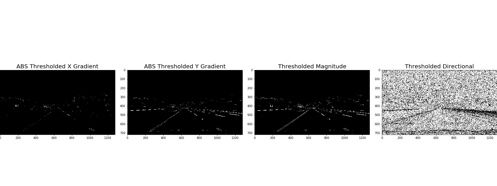
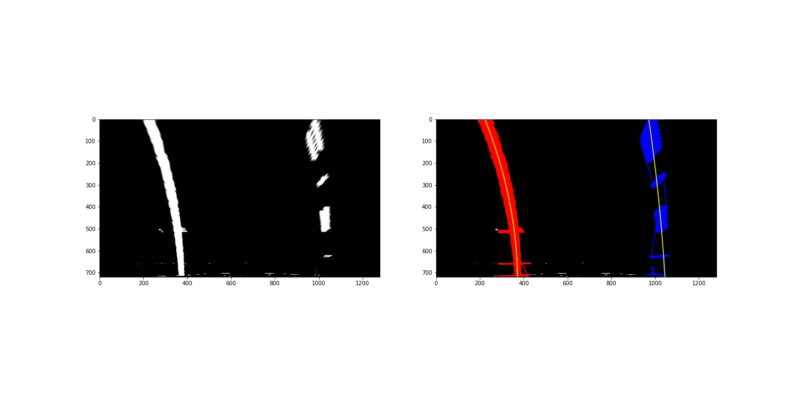
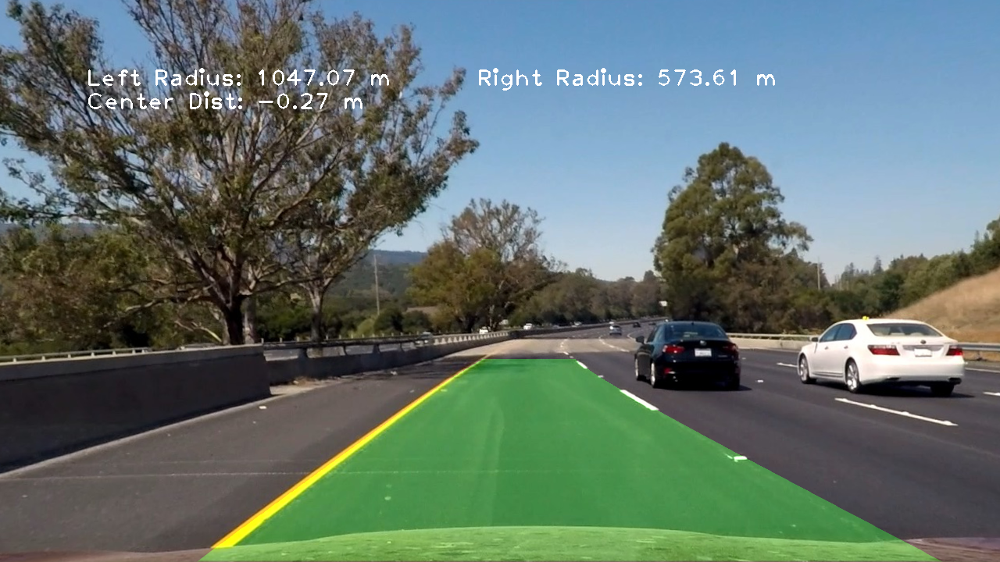

## The Project
---

The goals / steps of this project are the following:  

* Compute the camera calibration matrix and distortion coefficients given a set of chessboard images.  
* Apply a distortion correction to raw images.  
* Use color transforms, gradients, etc., to create a thresholded binary image.  
* Apply a perspective transform to rectify binary image ("birds-eye view").
* Detect lane pixels and fit to find the lane boundary.
* Determine the curvature of the lane and vehicle position with respect to center.
* Warp the detected lane boundaries back onto the original image.
* Output visual display of the lane boundaries and numerical estimation of lane curvature and vehicle position.  

- Image Source
The images for camera calibration are stored in the folder called `camera_cal`.  The images in `test_images` are for testing pipeline on single frames. 
- Image Output
Stored all examples of the output from each stage of the pipeline in the folder called `output_images`, and included a description in each stages what each image shows in the Pipeline(test images): section.    
[output image repository](./output_images) 
- Video Source 
    - `project_video.mp4` [project_video](./project_video.mp4)  
    - `challenge_video.mp4` [optional challenge](./challenge_video.mp4) under somewhat trickier conditions.
- Video output 
Stored output from pipeline in the folder called `output_videos`, and included a description in the Pipeline(videos): section.  
    - `project_video.mp4` [main video output](./output_videos/project_video_result.mp4)  
    - `challenge_video.mp4` [optional challenge output](./output_videos/project_video_challenge.mp4)

### Camera Calibration : 
---
1. Briefly state how you computed the camera matrix and distortion coefficients. Provide an example of a distortion corrected calibration image.
The calibration images in the lesson exercise were taken with a different camera setting (9x6 chessboard images) for the project . So that I set the number of inside corners in x as 9 and the number of inside corners in y as 6. Some of these images were not appeared because the specified number of chessboard corners were not found(calibration1.jpg,calibration4.jpg,calibration5.jpg) 
  
I used cv2.findChessboardCorners() OpenCV functions to calculate the correct camera matrix and distortion coefficients after getting gray scale images from the calibration chessboard images in the repository(`camera_cal`). The distortion matrix should be used to un-distort one of the calibration images provided as a demonstration that the calibration is correct. Examples of undistorted calibration image are saved to a folder: `output_images` by following naming convention:*original file name+_cal.jpg*.
  
I start by preparing "object points", which will be the (x, y, z) coordinates of the chessboard corners. However, we assume 2D plane rather than 3D so the chessboard is fixed on the (x, y) plane at z=0, such that the object points are the same for each calibration image. Thus, objp is just a replicated array of coordinates, and 'objpoints' will be appended with a copy of it every time whenever chessboard corners in a test image are successfully detected. 'imgpoints' will be appended with the (x, y) pixel position of each of the corners in the image plane with each successful chessboard detection.
  
I then used the output objpoints and imgpoints to compute the camera calibration and distortion coefficients using the cv2.calibrateCamera() OpenCV function by passing two arrays(objpoints, imgpoints) along with image size parameter. I applied this distortion correction function; cv2.undistort().

### Pipeline (test images) : 
---
1. Distortion correction  
Distortion correction that was previously calculated via camera calibration has been correctly applied to each image. So that I used same parameter (calibration_params) from chessboard case and then applied the cv2.undistort() function to all the images in the  [test_image folder](./test_images). All distortion corrected image are obtained and stored in [output image folder](./output_images).Here is one example:  
[test5_corrected image](./output_images/test5_undistort.jpg) is obtained from a original [test5 image](./test_images/test5.jpg)
All images in the [test_image folder](./test_images) are applied and saved by following naming convention in the [output_images folder](./output_images): 
*orginal file name_undistort.jpg* 

2. color transforms, gradients and combination of method with thresholded
1) def abs_sobel_thresh, def mag_thresh, def dir_threshold  
First of all, I experimented Sobel gradients openCV function(cv2.Sobel()) in both the x and the y directions to detect the lane lines and pick up other edges. Here's an example of my output for this experiment.  
 
From left, ABS Thresholded X-direction Gradient, ABS Thresholded Y-direction Gradient, Magnitude, Directional 
    1. Taking the gradient in the x direction emphasizes edges closer to vertical.(the first image)
    2. Taking the gradient in the y direction emphasizes edges closer to horizontal.(the second image)
    3. For a gradient in both the x and y directions, the magnitude is the square root of the sum of the squares.(the third image)
    4. In case of lane lines, we're only interested in edges of a particular orientation so that by taking arctangent of x and y gradients the direction of the gradient is obtained. However the direction of the gradient is much noisier than the gradient magnitude.  
2) def hls_select, def hls_threshold(image, thresh_l=(160,255), thres_s=(180,255)):  
Secold, I explored HLS color space transforms and color thresholds. Here's an example of my output for this experiment. 
* [HLS Color Thresholds](./output_images/HLS_test6.jpg)
* [HSV Color Thresholds](./output_images/HSV_test6.jpg)
* [LUV Color Thresholds](./output_images/LUV_test6.jpg)
* [LAB Color Thresholds](./output_images/LAB_test6.jpg)
* [RGB Color Thresholds](./output_images/RGB_test6.jpg)

HLS L-channel measures the relative lightness or darkness of a color. S-channel, Saturation, measures relative colorfulness. So, as colors get lighter and closer to white, like lane colors, they have a lower saturation value. 
Used a original [test6](./test_images/test6.jpg) first converted to grayscale, and applied L-channel, S-channel, and figured The S channel picks up the lines well, thus applied S-channel with a threshold that identifies the lines(the second image). I used open CV function (cv2.cvtColor(image, cv2.COLOR_BGR2HLS)) to get HLS color space.
* S-channel of HLS colorspace is good to find the yellow line
* R-channel of RGB colorspace is pretty good to find required lines in some conditions.
* L-channel of LAB colorspace for the white line.
With all in combination with gradients, I got the final combined binary by adding bit-wise operation as follows 
``code
  combined[((gradx == 1) & (grady == 1)) | ((hls_binary == 1) & (lab_binary == 1)) | ((mag_binary == 1) & (dir_binary == 1))] = 1
``
3) Lastly, I experimented a combination of color and gradient thresholds to generate a binary image. 
There is no "ground truth" when it comes to applying the combination of methods (i.e., color transforms, gradients). Just experimental threshold values are identified from experiments: thresh_Lchannel=(160,255), thres_Schannel=(180,255)

3. A perspective transform (def warper(img, src, dst): )
OpenCV function (cv2.getPerspectiveTransform) is used to correctly rectify each image to a "birds-eye view". To obtain "brids-eye view" simple ways is to investigate an image where the lane lines are straight, and find four points lying along the lines that, after perspective transform, make the lines look straight and vertical from a bird's eye view perspective.  
  
The code for my perspective transform includes a function called warper(). The warper() function takes as inputs an image (img), as well as source (src) and destination (dst) points. I chose the hardcoded the source and destination points in the following manner:
 For source points I'm grabbing the outer four detected corners
 ```python
        src = np.float32([corners[0], corners[nx-1], corners[-1], corners[-nx]])
 ```
 For destination points, I'm arbitrarily choosing some points to be a nice fit for displaying our warped result again, not exact, but close enough for the purposes
  ```python
        dst = np.float32([[offset, offset], [img_size[0]-offset, offset], 
                                     [img_size[0]-offset, img_size[1]-offset], 
                                     [offset, img_size[1]-offset]])
  ```                        
  Given src and dst points, I calculated the perspective transform matrix by using OpenCV cv2.getPerspectiveTransform(src, dst).
This resulted in the following source and destination points:  
| Source        | Destination   | 
|:-------------:|:-------------:| 
| 250, 670      | 250, 720      | 
| 590, 450      | 250, 0        |
| 690, 450      | 1100, 0       |
| 1100, 670     | 1100, 720     |
  
I verified that my perspective transform was working as expected by drawing the src and dst points onto a test image and its warped counterpart to verify that the lines appear parallel in the warped image for both a straight line and a curved line.  Even though this shows transformed coordinates in a birds' eye view, There needed to estimate/detect curved line on the right. So It needs to calcuate curvature for this curved lines.
  
  
4. lane-line pixels Identification(def find_lane_pixels(binary_warped):
fit their positions with a 2nd order polynomial(def fit_polynomial(binary_warped):  
After obtaining binary warped image, then I only take the half bottom of the image to identify the two highest peaks from a histogram as a starting point for determining where the lane lines are, and then use sliding windows moving upward in the image (further along the road) to determine where the lane lines go.  

   1. def find_lane_pixels(binary_warped):
   A histogram approach was introduced to find the points belonging to each lane line to be able to do a polynomial adjust and find the clear line. Then split the histogram into two region from a mid point ; One for left lane and one for right lane. Then small windows of size is move from bottom to top on left and right image seperately.Based on max histogram out, pixel location is calculated. The pixel location across the windows are saved in an array.
       ```python
        midpoint = np.int(histogram.shape[0]//2)
        leftx_base = np.argmax(histogram[:midpoint])
        rightx_base = np.argmax(histogram[midpoint:]) + midpoint
       ```
   then identify the nonzero pixels in x and y within the window and append these indentified indices to the x and y lists
   ,and if there are more than minpix, slide the window over to the mean of these pixels.

   2. def fit_polynomial(binary_warped):
   After fidning lane line pixels, Fit a second order polynomial to each using `np.polyfit` to fit the pixel locations. 
  
    ```python
    left_fit = np.polyfit(lefty, leftx, 2)
    right_fit = np.polyfit(righty, rightx, 2)
    
    rectangles = visualization_data[0]
    histogram = visualization_data[1]
    # Generate x and y values for plotting
    ploty = np.linspace(0, binary_warped.shape[0]-1, binary_warped.shape[0] )
    try:
        left_fitx = left_fit[0]*ploty**2 + left_fit[1]*ploty + left_fit[2]
        right_fitx = right_fit[0]*ploty**2 + right_fit[1]*ploty + right_fit[2]
    except TypeError:
        # Avoids an error if left_fit and right_fit are still none or incorrect
        print('The function failed to fit a line!')
        left_fitx = 1*ploty**2 + 1*ploty
        right_fitx = 1*ploty**2 + 1*ploty
       ```
        
And then used left_lane_inds and right_lane_inds to hold the pixel values contained within the boundaries of a given sliding window. I take the polynomial functions that fit before (left_fit and right_fit), along with a hyperparameter margin, to determine which activated pixels fall into the 'yellow' shaded areas in the below image. 
The left and right line have been identified and I used thier x and y pixel positions to fit with a curved functional form( a second order polynomial curve):f(y) = Ay^2 + By + C (using `np.polyfit`). The lane lines in the warped image are near vertical and may have the same x value for more than one y value. 
From test5.jpg I fit the 2nd order polynomial curve like this:


5. def measure_curvature(left_fit, right_fit, warped_combination):
calculated the radius of curvature of the lane and the position of the vehicle with respect to center.
Here the idea is to take the measurements of where the lane lines are and estimate how much the road is curving and where the vehicle is located with respect to the center of the lane. The radius of curvature may be given in meters assuming the curve of the road follows a circle. For the position of the vehicle, we can assume the camera is mounted at the center of the car and the deviation of the midpoint of the lane from the center of the image is the offset driver is looking for. As with the polynomial fitting, convert from pixels to meters.

    ```python
     ploty = np.linspace(0, warped_combination.shape[0]-1, warped_combination.shape[0] )
    left_fitx = left_fit[0]*ploty**2 + left_fit[1]*ploty + left_fit[2]
    right_fitx = right_fit[0]*ploty**2 + right_fit[1]*ploty + right_fit[2]

    left_fit_cr = np.polyfit(ploty*ym_per_pix, left_fitx*xm_per_pix, 2)
    right_fit_cr = np.polyfit(ploty*ym_per_pix, right_fitx*xm_per_pix, 2)

    # Define y-value where we want radius of curvature
    # choose the maximum y-value, corresponding to the bottom of the image
    y_eval = np.max(ploty)
    
    ##### the calculation of R_curve (radius of curvature)
    #left_curverad: Implement the calculation of the left line here
    #right_curverad: Implement the calculation of the right line here
    left_curverad = ((1 + (2*left_fit_cr[0]*y_eval*ym_per_pix + left_fit_cr[1])**2)**1.5) / np.absolute(2*left_fit_cr[0])
    right_curverad = ((1 + (2*right_fit_cr[0]*y_eval*ym_per_pix + right_fit_cr[1])**2)**1.5) / np.absolute(2*right_fit_cr[0])
    average_curverad = (left_curverad+right_curverad)/2
    ```
Calculated the radius of curvature based on pixel values, so the radius is in pixel space, which is not the same as real world space. For this project, it is assumed that the lane is about 30 meters long and 3.7 meters wide. The position of the vehicle is identified by taking a point on the left and right lane respectively and center point of the lane is calculated. The center of the image in pixel is 640. The difference between lane and pixel center is then multiplied by meteres per pixel in x dimension (3.7/700) to obtain vehicle position off the center.
    ```python
    # Define conversions in x and y from pixels space to meters
    ym_per_pix = 30/720 # meters per pixel in y dimension
    xm_per_pix = 3.7/700 # meters per pixel in x dimension
    ```
6. result
Everything is put together to project the lanes on an image at first, but later on, the same technique is used on a frame by frame processing of a video stream.
Here is an example of my result on a test image with lanes, curvature, and position from center:

All test image outputs filled with lanes, curvature, and position from center are saved here:
[output_images](./output_images) by following naming convention : fill_lane_{number}.jpg
fill_lane_0.jpg to fill_lane_7.jpg 
All 8 images are stored in one figure:[all_fill_lane](./output_images/fill_lane_all.jpg) 
The fit from the rectified image has been warped back onto the original image and plotted to identify the lane boundaries. 

### Pipeline (videos) : 
---
1. The final video outputs are stored in `output_videos` folder. The performance of videos are decent , somewhat jittering lines when the scene is filled with shades but no catastrophic failures.  
- Main output: [project_video_result.mp4](./output_videos/project_video_result.mp4)  
- For challen(optional) output: [project_video_challenge.mp4](./output_videos/project_video_challenge.mp4)  

The image processing pipeline that was established to find the lane lines in images successfully processes the video. The output here is a video where the lanes are identified in every frame, and outputs are generated regarding the radius of curvature of the lane and vehicle position within the lane. The pipeline maps out curved lines and output videos are stored in [output video folder](./output_videos/) for both the main project video and a challenge video.

### Discussion
1. Outstanding problems / issues in the project implementation of this project and what could be improved.  
Should not search blindly for the lane lines in each frame of video, but rather, once a high-confidence detection is obtained, I need to use that to inform the search for the position of the lines in subsequent frames of video. For example, if a polynomial fit was found to be robust in the previous frame, then rather than search the entire next frame for the lines, just a window around the previous detection could be searched. This will improve speed and provide a more robust method for rejecting outliers.
  
With implementation of outlier rejection and a low-pass filter to smooth the lane detection over frames could be implemented, by adding each new detection to a weighted mean of the position of the lines to avoid jitter effect.

